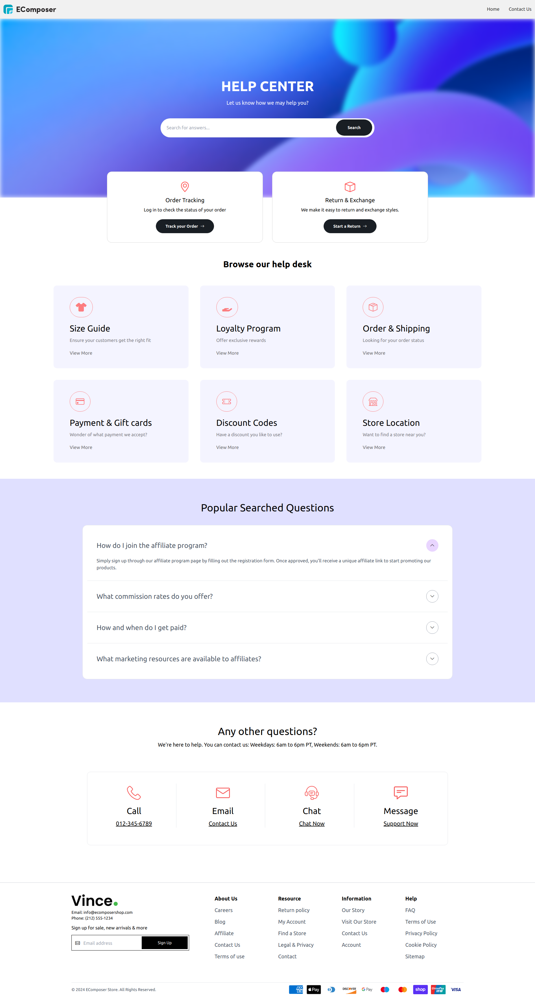
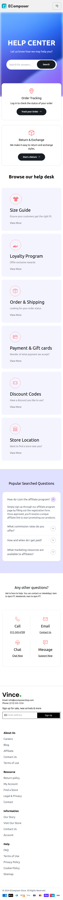

# eComposer (1 Week Task)

Welcome to the Ecomposer Week Task repository! This project is a modern e-commerce web application that showcases a range of advanced front-end technologies. Below, you'll find a comprehensive overview of the project, including its features, technologies used, and how to get started.

## Table of Contents
- [Project Overview](#project-overview)
- [Features](#features)
- [Architectural Choices](#architectural-choices)
- [Development Practices](#development-practices)
- [Technologies Used](#technologies-used)
- [Context API Usage](#context-api-usage)
- [Screenshots](#screenshots)
- [Installation](#installation)
- [Usage](#usage)

## Project Overview

Ecomposer is a modern e-commerce web application built using React, designed with a focus on clean code, modular architecture, and best practices in state management. 

## Features

- **User-Friendly Interface:** A clean and modern UI built with Tailwind CSS and DaisyUI components.
- **Responsive Design:** Fully responsive layout that works seamlessly on desktop and mobile devices.
- **Error Handling:** Utilizes `react-error-boundaries` for effective error management and a smoother user experience.
- **Smooth Animations:** Incorporates AOS (Animate On Scroll) for engaging scrolling animations.
- **Progressive Web App (PWA):** Provides a native app-like experience, enabling offline access and improved performance.
- **Dynamic Content (using Context API):** Fetches and displays products dynamically, enhancing user interaction and engagement.

### Architectural Choices

- **Component-Based Structure:** The application is structured into reusable components, promoting reusability and separation of concerns. Each component is responsible for a specific piece of functionality or UI element, making it easier to maintain and test.
- **Context API for State Management:** Instead of using Redux, I opted for the Context API to manage global state. This decision simplifies state management for the application, reducing boilerplate code and enhancing readability while still avoiding prop drilling.
- **Styling with Tailwind CSS and DaisyUI:** The use of Tailwind CSS allows for utility-first styling, enabling rapid prototyping and custom designs without leaving the HTML. DaisyUI complements Tailwind by providing pre-designed components, speeding up the development process.
- **Error Handling:** The application employs `react-error-boundaries` to catch and handle errors gracefully, ensuring a smooth user experience. This allows developers to manage unexpected issues without compromising the entire application.
- **Animations with AOS:** AOS (Animate On Scroll) is integrated to provide smooth and engaging animations as users scroll through the application, enhancing user interaction.

### Development Practices

- **Code Quality:** I followed best practices for clean and maintainable code, including meaningful naming conventions, component modularity, and thorough documentation within the codebase.
- **Responsive Design:** The application is built with a mobile-first approach, ensuring that it works seamlessly across various devices and screen sizes.
- **Progressive Web App (PWA):** The application is designed as a PWA, which enhances performance and provides offline capabilities, delivering a native app-like experience.

## Technologies Used

- **React:** A JavaScript library for building user interfaces.
- **React Error Boundaries:** For catching JavaScript errors anywhere in the component tree, logging those errors, and displaying a fallback UI.
- **AOS (Animate On Scroll):** A library to animate elements as they scroll into view, enhancing user engagement.
- **PWA (Progressive Web App):** Ensures the app behaves like a native mobile application, with offline capabilities and enhanced performance.
- **Tailwind CSS:** A utility-first CSS framework for creating custom designs without leaving your HTML.
- **DaisyUI:** A component library for Tailwind CSS, providing pre-designed components that speed up development.
- **Context API:** A feature of React that allows for state management and sharing data across components without prop drilling.

## Context API Usage

The Context API is employed in this application to manage global state and facilitate communication between deeply nested components. By using the Context API, we can:

- **Simplicity:** The Context API is simpler to set up and understand compared to Redux, making it ideal for smaller applications or those with less complex state management needs.
- **Reduced Boilerplate:** Unlike Redux, which requires multiple files and boilerplate code for actions, reducers, and stores, the Context API allows us to manage state with minimal configuration.
- **Avoid Prop Drilling:** It eliminates the need to pass props down through multiple levels of components, simplifying component hierarchies and making the code cleaner and easier to maintain.
- **Centralized State Management:** Global state, such as user authentication status or shopping cart contents, can be managed in a single location, making it easier to access and update across different components.
- **Improved Performance:** The Context API can optimize re-renders by allowing components to subscribe to only the specific parts of the state they need, rather than re-rendering all components that depend on a higher-level state.


By utilizing the Context API, we enhance the maintainability and scalability of the application, making it easier to manage shared state in a clear and efficient manner.

## Screenshots

Here are some screenshots of the Ecomposer application:

### Home Page (Desktop View)


### Home Page (Mobile View)


### Contact Us Page (Desktop View)


### Contact Us Page (Mobile View)


## Installation

To get started with this project, clone the repository and install the necessary dependencies:

```bash
git clone https://github.com/shalabhkamboj53/ecomposer-week-task.git
cd ecomposer-week-task
npm install
```

## Usage
Once you have installed the dependencies, you can start the development server:

```bash
npm run dev
```

This will run the application in development mode. Open http://localhost:5173 to view it in your browser.

## Live Demo

You can view the live version of the Ecomposer application here: [Ecomposer Live Demo](https://ecomposer-week-task.vercel.app).
